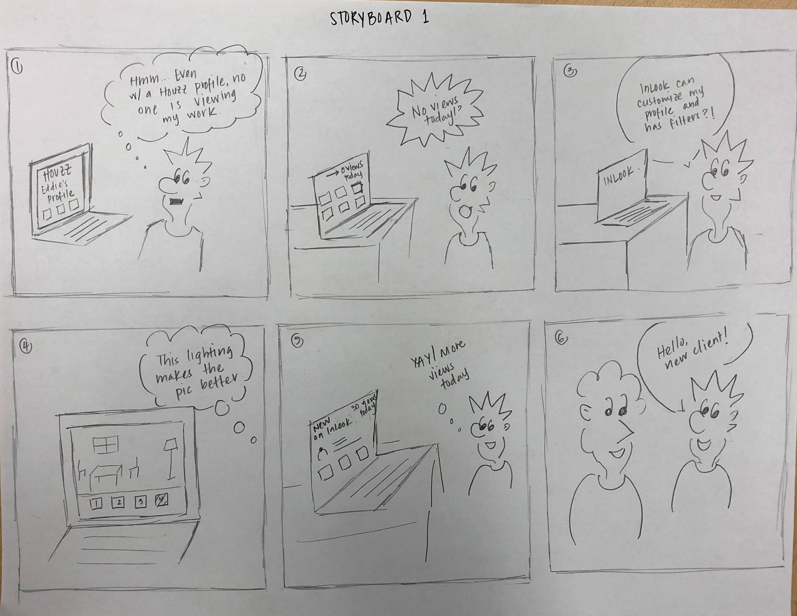
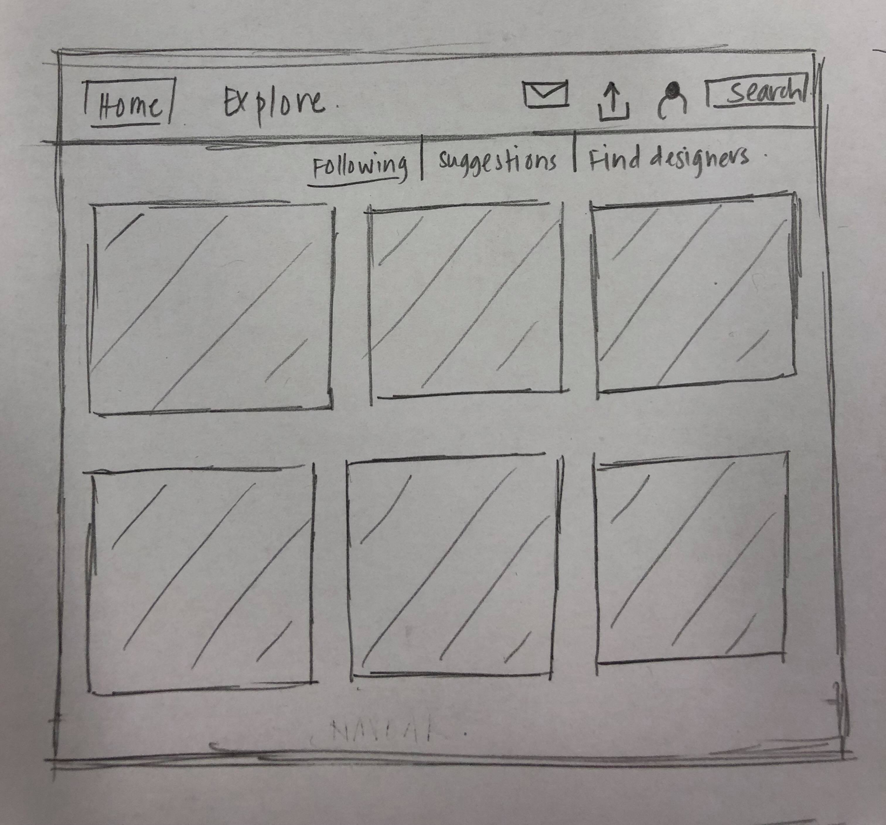
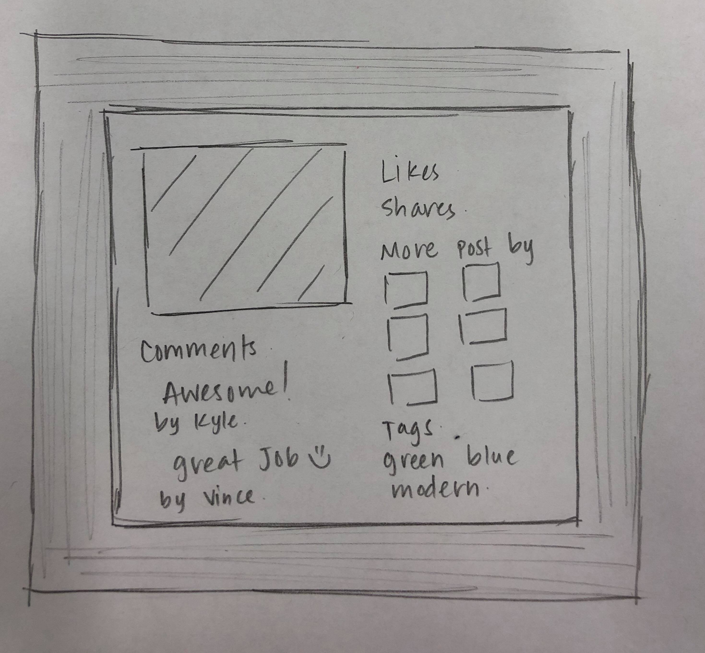
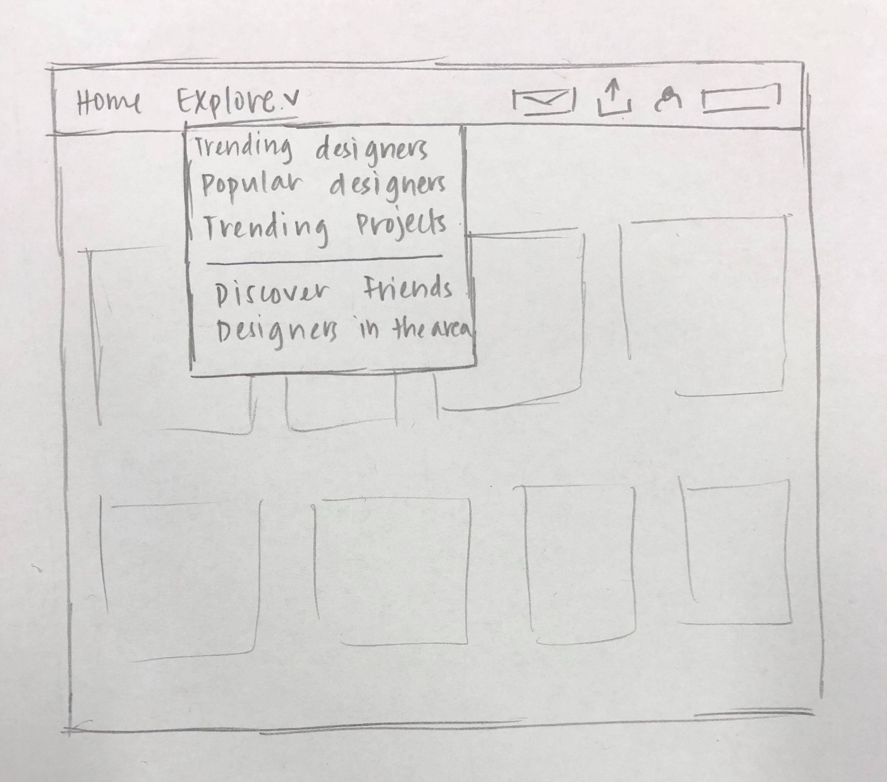
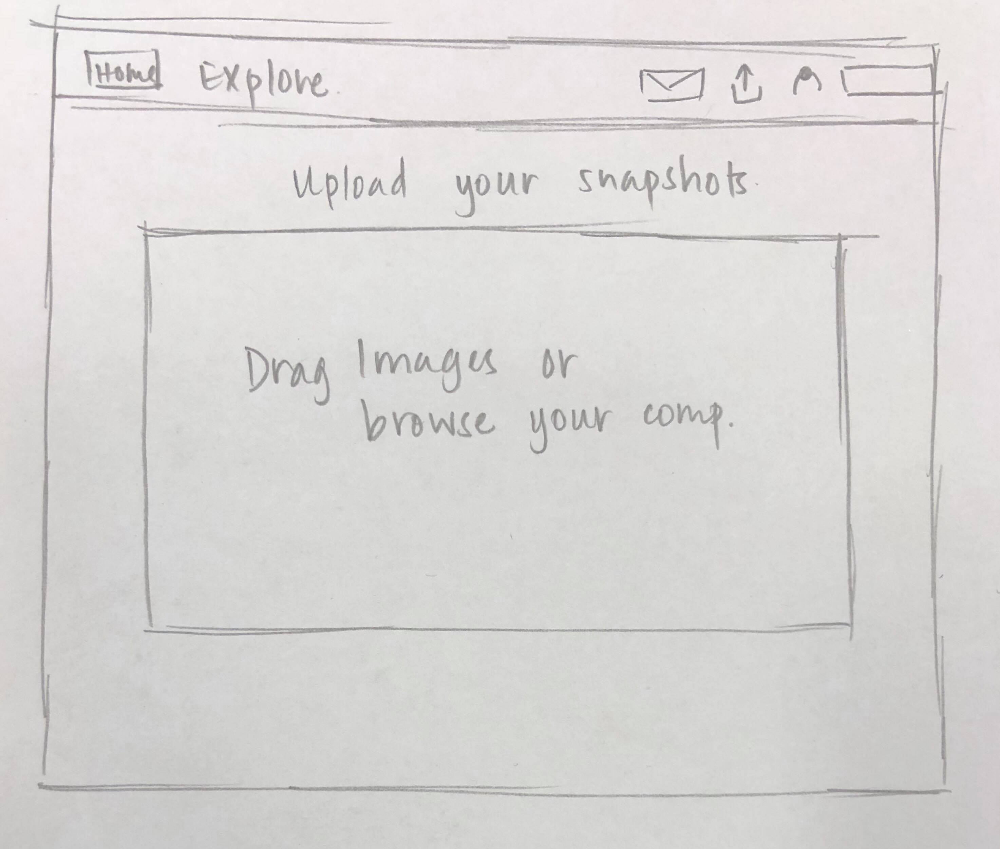
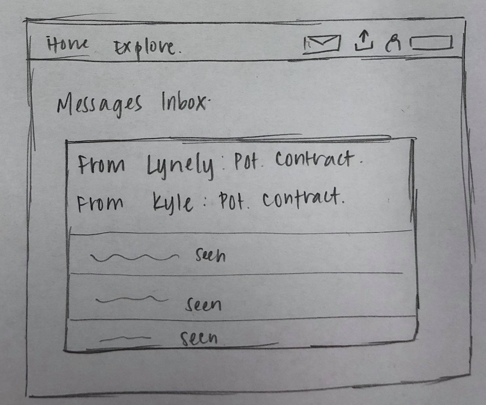
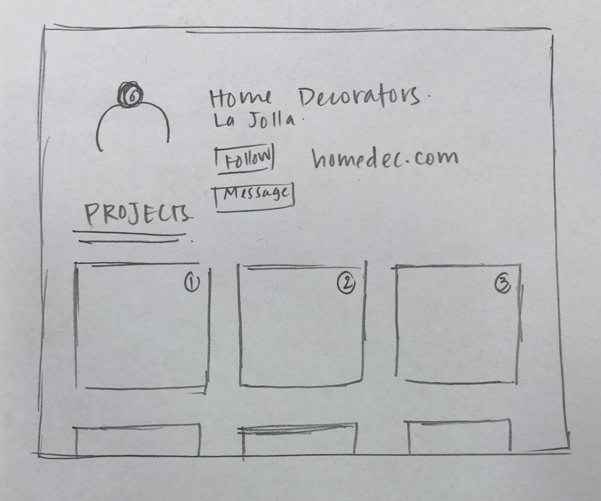
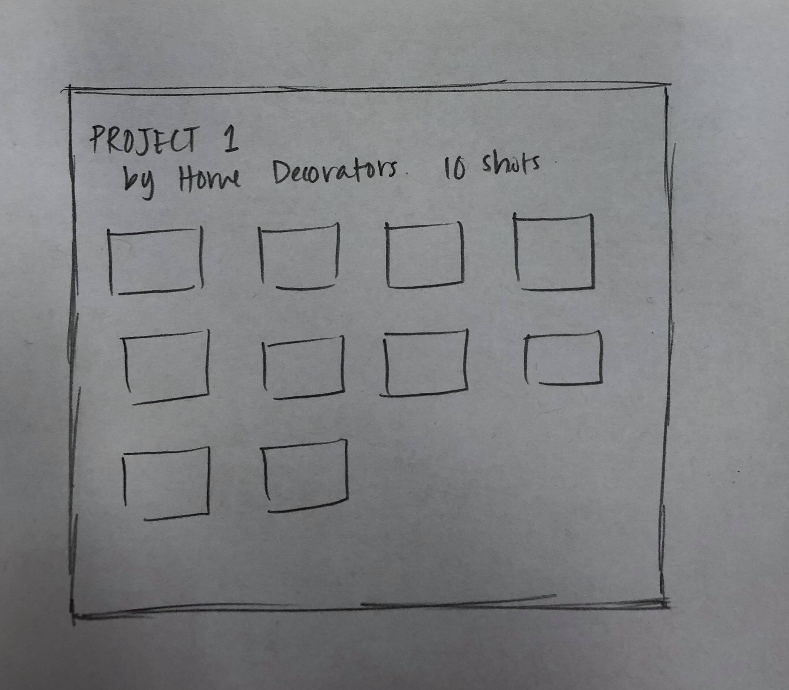

# Milestone #2

__Storyboard 1__

__Storyboard 2__

__Prototype 1__

The homepage features "project stories" as well as trending/popular designers

"Project stories" follow designers through project process

Under the explore tab, you can view popular and trending designers and projects

Users can send direct messages with designers that include images 

Users can upload images of their work

Users can add filters to their images to make them more appealing

The profile page features the designers work as well as blog posts that follow their design story and style

Users can explore designers individual projects

__Prototype 2__
 
 The home page of the webapp

 
 When you click on an image, this pop-up will show up

 
 The drop down menu will show up when user clicks on the 'Explore' button

 
 User can upload images(their work) using this button on the nav bar

 
 Users can check their messages in the 'message' tab

 
 User's profile

 
 Users can see details of project's on various user profiles by clicking on the project in the profile view
