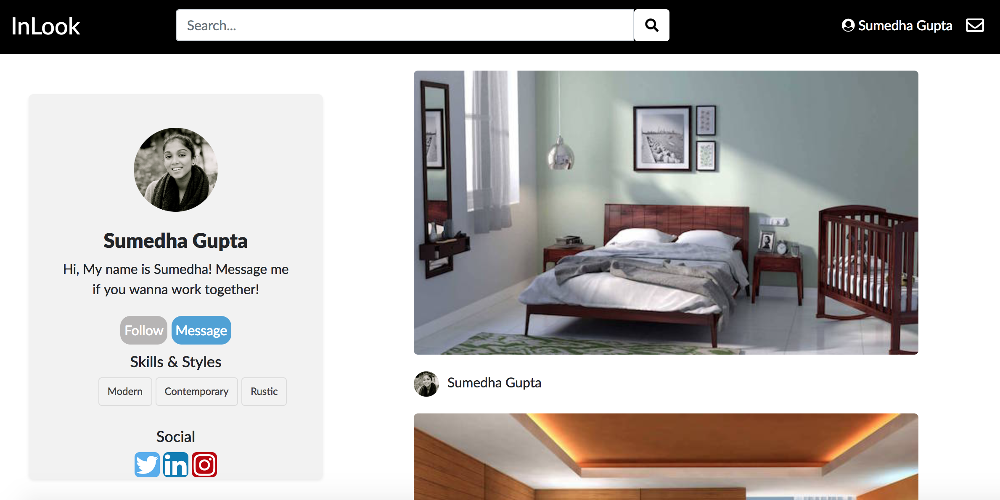

# Milestone 4

__Screenshots__
UI Skeleton Webpages

__Screen #1(Messages)__

__Screen #2(Profile)__

__Screen #3(Login)__

__Screen #4(Signup)__

__Explanation__
Our messages and profile page are significantly changed in terms of the layout. We made the messages page responsive using flexbox and we will continue to work on the layout a little more. The messages page currently shows a skeleton of the final product. It is an informal look similar to facebook messenger rather than Gmail.

Our profile page has changed since last week. We cleaned it up a little more and made the pictures(projects) a little larger so users can scroll through the projects and get a good view of what the designer's work is like.
